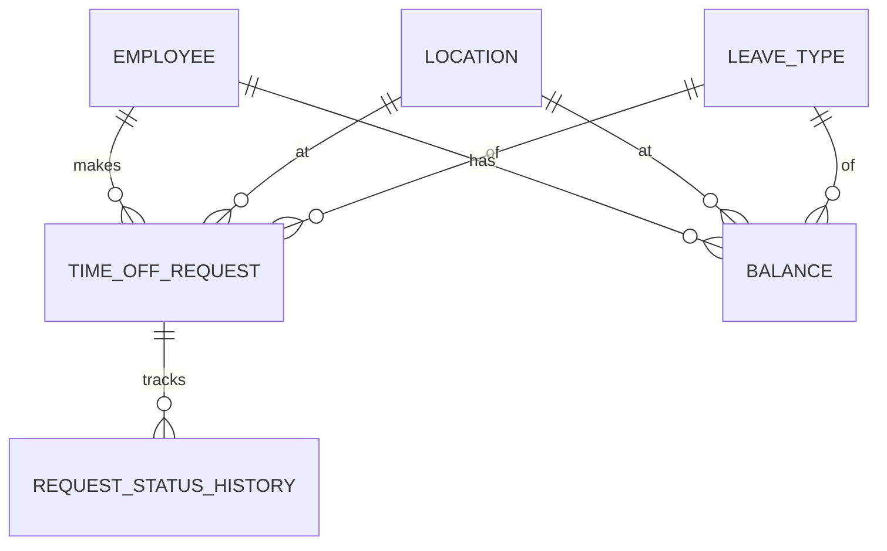

# Technical Requirement Document (TRD) - Time-Off Microservice

## 1. Product Context & Objectives
The Time-Off Microservice manages employee time-off requests while keeping balances synced with an external Human Capital Management (HCM) system, which serves as the "Source of Truth".
The challenge is that the HCM balance changes independently (e.g. work anniversary, yearly resets), and our local system (ReadyOn) must defensively sync and validate before making updates.

## 2. Architecture & Design

### Components
1. **Core Domain**: Employees, Locations, LeaveTypes.
2. **Time-Off Lifecycle**: Manages requests through a state machine (PENDING -> APPROVED -> SUBMITTED_TO_HCM -> CONFIRMED/HCM_REJECTED/CANCELLED).
3. **Sync Engine**: Handles real-time balance fetching, batch updates from HCM, and reconciliation jobs.

### Data Model (ERD)

### Sync Strategy & Conflict Resolution
- **HCM is Source of Truth**: On conflicts, HCM always wins.
- **Defensive Deductions**: Our system tracks `available`, `used`, and `pending`. We never allow a request if `requested_days > (available - used - pending)`.
- **Reconciliation**: A sync job checks local vs HCM, updates local if needed, and re-evaluates all pending requests. If pending requests exceed the new balance, they are flagged.
- **Optimistic Locking**: Balances use a `@VersionColumn` to prevent race conditions when multiple requests happen concurrently.

## 3. Endpoints

- **Employees**: `GET /employees`, `POST /employees`, `PATCH /employees/:id`, `DELETE /employees/:id`
- **Locations**: `GET /locations`, `POST /locations`, `PATCH /locations/:id`, `DELETE /locations/:id`
- **Leave Types**: `GET /leave-types`, `POST /leave-types`, `PATCH /leave-types/:id`, `DELETE /leave-types/:id`
- **Balances**: `GET /balances`, `POST /balances`, `PATCH /balances/:id`, `DELETE /balances/:id`
- **Time Off Requests**: 
  - `POST /time-off-requests`
  - `GET /time-off-requests`
  - `PATCH /time-off-requests/:id/approve`
  - `PATCH /time-off-requests/:id/reject`
  - `PATCH /time-off-requests/:id/cancel`
- **Sync**:
  - `POST /sync/batch`
  - `POST /sync/employee/:employeeId/:locationId/:leaveTypeCode`
  - `POST /sync/reconcile`
  - `GET /sync/logs`

## 4. Challenges & Alternative Solutions Considered

### Challenge 1: Handling Balance Mismatches
*Option A*: Stop requests until synced. (Too disruptive)
*Option B*: Let requests go into negative. (HCM will reject, bad UX)
*Option C (Chosen)*: Keep a local `pending` tally. When HCM updates the `available/used`, we calculate `effective = available - used - pending`. If `effective < 0` we flag the pending requests for manager review.

### Challenge 2: Network unreliability during HCM Submission
*Chosen Solution*: The state machine isolates the `SUBMITTED_TO_HCM` state. If the HCM network call fails, we can retry, or it goes to `HCM_REJECTED` state and the user's pending balance is restored.

## 5. Security & Scalability
- **Security**: Current design relies on headers. Future updates should use JWTs and Role-based access control (RBAC).
- **Scalability**: Sync logic is synchronous for now but can be offloaded to message queues (e.g. RabbitMQ/Kafka) for large batch updates.

## 6. Testing Strategy
- **Unit tests**: Ensure logic isolation, state machine transitions, and balance checks.
- **E2E tests**: Verify database transactions and controller-service wiring.
- **Mock HCM Server**: Standalone API used to mock HCM responses during integration testing.
